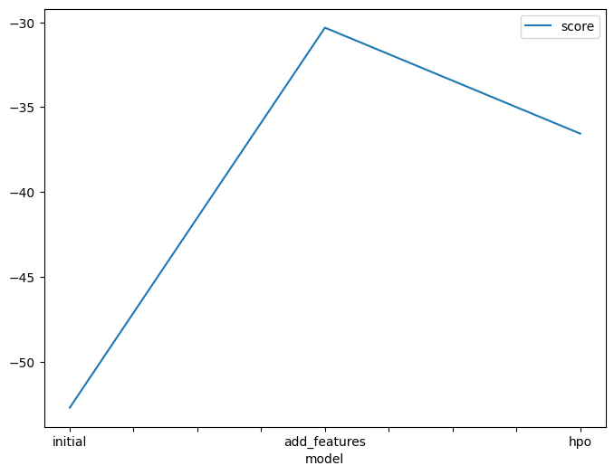
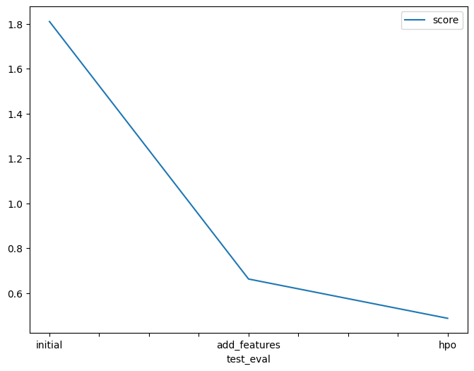

# Report: Predict Bike Sharing Demand with AutoGluon Solution
#### Ayushmaan Aggarwal

## Initial Training
### What did you realize when you tried to submit your predictions? What changes were needed to the output of the predictor to submit your results?
On initial submission of prediction, I realized that the score on kaggle is not very good. With hyperparamter tuning, the model score improved a lot. I completed this on google collab after experimenting a bit on SageMaker.

### What was the top ranked model that performed?
My top ranked model was weighted ensemble after hyperparameter tuning.

## Exploratory data analysis and feature creation
### What did the exploratory analysis find and how did you add additional features?
The exploratory analysis helped me by looking into the graphs of how the data was being affected by various factors. I found temperature and day time to be a big factor so I added something similar to that.

### How much better did your model preform after adding additional features and why do you think that is?
The model improved about 63% as compared to initial submission simply by refining the features. I think this is because I added an appropriate additional feature.

## Hyper parameter tuning
### How much better did your model preform after trying different hyper parameters?
The model improved by about 73% as compared to initial submission and 20% as compared to previous submission due to tuning of hyper parameters.

### If you were given more time with this dataset, where do you think you would spend more time?
I believe I'll spend more time in testing out different hyper parameters and add more additional features to see how much the model is able to improve.

### Create a table with the models you ran, the hyperparameters modified, and the kaggle score.
|model|hpo1|hpo2|hpo3|score|
|--|--|--|--|--|
|initial|default|default|default|1.80994|
|add_features|default|default|default|0.66320|
|hpo|num_leaves: lower=26, upper=66|dropout_prob: 0.0, 0.5|num_boost_round: 100|0.48817|

### Create a line plot showing the top model score for the three (or more) training runs during the project.

TODO: Replace the image below with your own.

### Create a line plot showing the top kaggle score for the three (or more) prediction submissions during the project.

TODO: Replace the image below with your own.

## Summary
I learned a great deal about the importance of exploratory data analysis and how picking the correct hyperparameters and features can increase model accuracy to a large degree. I have also understood how Autogluon makes it easier to test various models.
